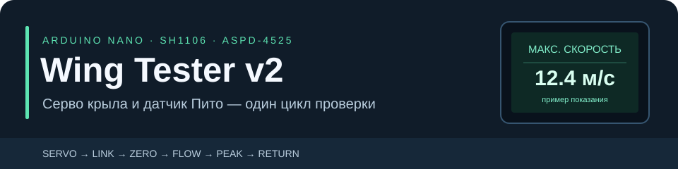

# Wing Tester v2

Автономный тестер **серво крыла и датчика Пито ASPD-4525** на Arduino Nano. Русский интерфейс на OLED ведёт оператора через весь цикл: движение крыла, проверку связи, фиксацию нуля, выдох, максимальную скорость и возврат давления к нулю.

**Текущий объём проекта завершён.** Прошивка: `peak-speed-v1`. Базовый цикл и статичный экран серво подтверждены пользователем на устройстве; добавленный экран максимальной скорости включён в итоговую сборку. Исходники, документация, проверки и контрольные копии находятся в этом репозитории.

## Один цикл — все проверки


| Этап | Что происходит | Действие оператора |
|---|---|---|
| **Серво** | Проход 92° → 160° → 20° → 92°, шаг 1° с задержкой 10 мс | Визуально оценить движение и возврат крыла |
| **Связь** | 100 попыток чтения, проверка пакетов, статусов и тайм-аутов | Не подавать поток |
| **Ноль** | 10 секунд оценки шума и дрейфа; сохранение исходного давления | Не дуть, дождаться окончания |
| **Дуйте** | Текущая скорость и обнаружение выдоха | Подать поток в трубку Пито |
| **Максимальная скорость** | Пиковая расчётная скорость за этап потока, показ 5 секунд | Посмотреть результат |
| **Не дуйте** | Возврат к исходному нулю: допуск ±5 Па в течение 1 секунды | Прекратить поток |
| **Итог** | Крупный **ОК** или **БРАК** с причиной остановки | Переподключить датчик для нового полного цикла |

При ошибке последовательность останавливается. Итог остаётся на экране до Reset или подтверждённого отключения и подключения датчика. Повтор включает **серво и все этапы Пито**. Кнопки не нужны.

> Скорость рассчитана по перепаду давления. Пороги тестера настраиваемые, а не заводские критерии брака. Исправность механики серво оценивается оператором; обратной связи о положении нет.

## Подключение

Целевая сборка — **классическая Arduino Nano с ATmega328P, 16 МГц**. Экран — **SH1106 128×64, аппаратный SPI**, датчик — **ASPD-4525, I²C 0x28**.

| Узел | Сигнал | Nano |
|---|---|---|
| Серво | Управление | **D7** |
| OLED | DC | **D8** |
| OLED | CS | **D9** |
| OLED | RESET | **D10** |
| OLED | MOSI | **D11** |
| OLED | SCK | **D13** |
| Пито | SDA | **A4** |
| Пито | SCL | **A5** |
| Узлы | Общая земля | **GND** |

В рабочем подключении OLED использует 5V. Питание серво выбирается по его модели; земля источника и Nano общая. Фактическая схема источника питания не зафиксирована. Диапазон давления в прошивке — **±1 PSI**: перед использованием другой модели датчика сверить диапазон и электрические параметры. [Подробнее о подключении](docs/hardware.md).

## Загрузка

1. Установить поддержку плат **Arduino AVR Boards** и библиотеки **U8g2**, **Servo**.
2. Открыть [`firmware/wing_tester/wing_tester.ino`](firmware/wing_tester/wing_tester.ino) в Arduino IDE.
3. Выбрать **Arduino Nano**, **ATmega328P** и порт платы. Вариант загрузчика выбирается по установленной Nano.
4. Загрузить прошивку. Для журнала открыть Serial Monitor на **115200 бод**.

Последняя проверенная конфигурация сборки: Arduino AVR Boards **1.8.8**, U8g2 **2.36.19**, Servo **1.3.0**.

| Ресурс | Итоговая сборка |
|---|---|
| Flash | **30 298 / 30 720 байт** |
| Глобальная RAM | **1 130 / 2 048 байт** |
| Буфер OLED | Страничный, 128 байт |

## Настройки

Все параметры находятся в блоке `cfg` в начале скетча. После изменения прошивку нужно загрузить заново.

| Параметр | По умолчанию | Назначение |
|---|---|---|
| `kServoTestEnabled` | `true` | Серво первым этапом каждого цикла |
| `kServoStepMs` | `10` мс | Темп команд движения |
| `kZeroTestDurationMs` | `10000` мс | Проверка нуля |
| `kFlowThresholdPa` | `50` Па | Порог реакции относительно нуля |
| `kFlowWaitMs` | `10000` мс | Максимальное ожидание выдоха |
| `kPeakSpeedDisplayMs` | `5000` мс | Показ максимальной скорости |
| `kReturnBandPa` | `5` Па | Допуск возврата |
| `kSpeedInKmh` | `false` | `false`: м/с; `true`: км/ч |
| `kAutoRestartOnReconnect` | `true` | Полный повтор после переподключения |

[Все критерии и ограничения](docs/requirements.md) · [Шум и дрейф](docs/step3-zero.md) · [Обнаружение потока](docs/step4-flow.md).

## Сборка и проверки

В Windows с установленной Arduino IDE и библиотеками:

```powershell
powershell -ExecutionPolicy Bypass -File scripts/check.ps1
```

Скрипт собирает прошивку для `arduino:avr:nano:cpu=atmega328` и компилирует три набора `static_assert`: статистика нуля, подтверждение потока и обнаружение переподключения. При ошибке завершает работу с ненулевым кодом. Артефакты пишутся в `build/`, исключённый из Git. [Подробности и ручная команда](docs/verification.md).

## Структура проекта

```text
firmware/wing_tester/   Скетч, алгоритмы и исходная лицензия серво
scripts/               Повторяемая сборка и проверки
tests/                 Проверки алгоритмов на синтетических данных
docs/                  Подключение, сценарий и детали этапов
checkpoints/           Контрольные копии рабочих прошивок
old/                   Исходные скетчи, сохранённые без изменений
```

## Документация и контрольные копии

- [Сценарий и критерии](docs/requirements.md)
- [Аппаратная часть](docs/hardware.md)
- [Серво и стабильный экран](docs/servo-check.md)
- [Связь](docs/step2-link.md) · [Ноль](docs/step3-zero.md) · [Поток](docs/step4-flow.md) · [Возврат](docs/step5-return.md)
- [Максимальная скорость](docs/peak-speed.md) · [Автоповтор](docs/reconnect.md)
- [Завершение проекта и результаты проверок](docs/development-plan.md)

`checkpoints/reconnect-v2-working.*` — рабочий цикл Пито до включения серво. `checkpoints/servo-first-v4-working.*` — подтверждённый полный цикл со статичным экраном серво до добавления максимальной скорости. ZIP содержит исходники и документы соответствующего момента; HEX предназначен для той же конфигурации Nano. Эти копии сохраняют историю, текущая версия — в `firmware/`.

Итоговая сборка: [HEX peak-speed-v1](checkpoints/peak-speed-v1-final.hex) · [Исходники и документация](checkpoints/peak-speed-v1-final.zip). Эта контрольная копия прошла сборку и программные проверки; состав и ограничения аппаратной проверки описаны выше.

Логика прохода серво использует исходный пример Bolder Flight Systems. Его уведомление об авторских правах и лицензия сохранены в [`SERVO_SOURCE_LICENSE.txt`](firmware/wing_tester/SERVO_SOURCE_LICENSE.txt). Общая лицензия всего проекта отдельно не назначена.
